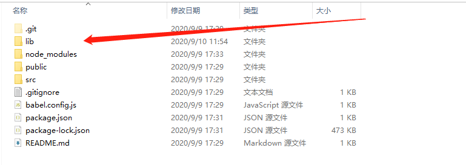
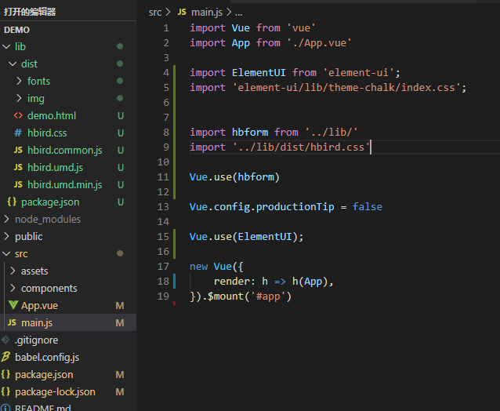

# 蜂鸟编辑器安装

### 蜂鸟使用教程
#### 一、下载安装`vue cli`脚手架
> 详细教程参考`vue cli`官网,官网地址：`https://cli.vuejs.org/zh/guide/installation.html`

#### 二、安装 `element ui `
> 详细教程参考`element ui `官网,官网地址：`https://element.eleme.cn/#/zh-CN/component/installation`

#### 三、安装 蜂鸟表单编辑器

#### 补充说明：`vue`新项目中是没有`lib`这个文件夹的,这个文件需要在此网址下载
网址：` https://worksite.coding.net/s/a43a8a5d-1bdf-41cc-bf26-258097bbec80 `


#### 引入 蜂鸟系统
###### 完整引入

``` 
import hbform from '../lib/'
import '../lib/dist/hbird.css'

Vue.use(hbform)
```


###### 引入部分组件
```
import {
  GenerateForm,
  MakingForm
} from '../lib/'
import '../lib/dist/hbird.css'
Vue.component(GenerateForm.name, GenerateForm)
Vue.component(MakingForm.name, MakingForm)
/* 或写为
 * Vue.use(GenerateForm)
 * Vue.use(MakingForm)
 */
```


