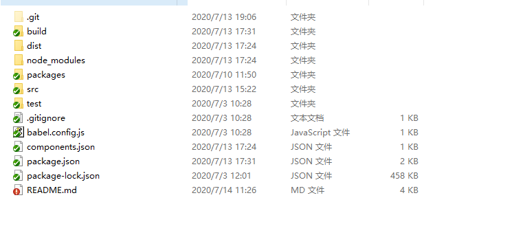
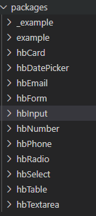
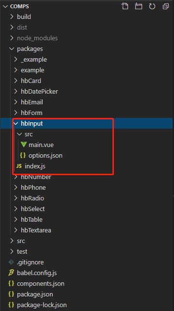
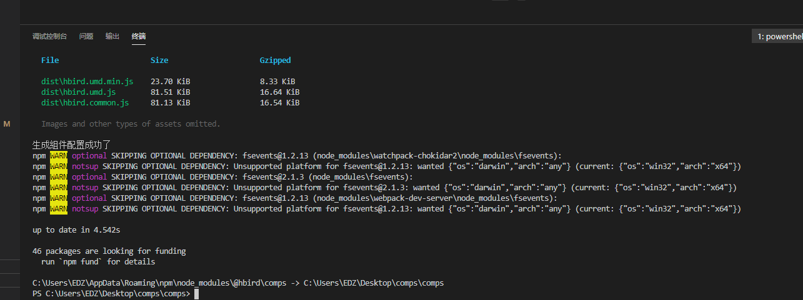

# 定制化组件

当您想定制开发自己的组件时,需要先clone下来组件库, ` git clone http://gitlab.xzxyun.com/campus/hbird/comps.git `,项目结构如下:


自定义配置组件只需要关注`packages`文件夹下内容:



`packages`文件夹下为自定义组件数据,拿`hbInput`组件举例如下图:



自定义组件首先需要创建组件文件夹,以`hb`开头驼峰命名的文件夹,其次内部需要创建`src`文件夹,文件夹下必须包含`main.vue`文件,
`options.json`文件,还需创建`src`同级目录的`index.js`文件.`main.vue`文件作为自定义组件主体功能文件,`options.json`文件,
作为编辑器中右侧配置栏,可配置项内容.`index.js`文件,导出自定义组件以便编辑器可以查找到

    
### 自定义组件库开发组件流程
> 示例 hbInput 组件  main.vue(组件代码如下)

```vue
<template >
  <el-input
    ref="hb_input"
    :placeholder="placeholder"
    v-model="comData.content"
    :maxlength="Number(maxLength)"
    :style="{width:width!='100%'?width+'px':'100%'}"
    @blur="checkRule"
    :type="type"
    v-bind="comData"              //此处 comData 代表外部传到组件内部的数据(此数据来源于编辑其中配置,也可进行手动修改).
  ></el-input>
</template>
<script>
export default {
  name: "hb-input",                             // 组件名称 必须输入
  props: {
    placeholder: {                             //自定义组件默认属性  (自定义属性可有可无根据自身开发组件功能,随便填写)
      type: String,
      default: "请输入内容"
    },
    type: {                                   //自定义组件默认属性
      type: String,
      default: ""
    },
    maxLength: {                             //自定义组件默认属性
      type: String
    },
    width: {                                //自定义组件默认属性
      type: String,
      default: "100%"
    },
    rule: {                                //自定义组件默认属性
      default: ""
    },
    comData: Object                      //必须接收comData 固定格式, 可以不使用comData,但是不能没有
  },
  watch: {   //组件内部逻辑
    comData: function(newV) {
      if (newV.content || newV.required) {
        this.checkRule();
      }
    }
  },
  data() {
    return {};
  },
  methods: {
    checkRule() {
      var reg = eval(this.rule + "");
      if (this.comData.required && this.comData.content === "") {
        this.showMessage("不能为空");
        return;
      }
      if (reg && !reg.test(this.comData.content)) {
        this.showMessage("输入格式有问题");
        this.comData.content=''
        return;
      }
    },
    showMessage(str) {
      let a = this.$refs.hb_input.$el;
      this.$message({
        showClose: true,
        message: str,
        type: "error",
        onClose: () => {
          a.style.border = "none";
        }
      });
      a.style.border = "1px solid red";
    }
  }
};
</script>

```

> 示例 hbInput 组件  options.json(配置文件内容如下)

```json
{
    "name": "输入框",                                      //组件中文名称 (必填!!!)
    "componentName": "hb-input",                          //此处组件名称要和代码中 name:字段的名称一致(必填!!!)
    "data": {},                                           //固定 写法 data:{}  (必填,可以为空对象!!!)
    "parent":"form",                                      //表示此组件属于表单系列,也可以不写,如果不写在编辑器中组件顺序会有影响
    "options": {                                          //options代表编辑器中右侧配置栏,你所创造的组件可配置的开放属性 (必填,可以为空对象!!!)
      "content": {                                        //自定义配置字段,name:属性代表,配置栏中介绍此属性的中文名称
        "name": "内容",
        "type": "input"                                   //type:属性代表,你想用户用什么方式输入内容,或者改变内容,目前(提功了 'input','switch') 两种,后续会迭代增加 'select' 等等 
      },
      "placeholder": {
        "name": "提示内容", 
        "type": "input"
      },
      "width": {
        "name": "输入框宽度(px)", 
        "type": "input"
      },
      "maxLength": {
        "name": "最大长度", 
        "type": "input"
      }
    }
}
```

> 示例 hbInput 组件  index.js(配置文件内容如下)
```
import Example from './src/main'

Example.install = function(Vue) {
    Vue.component(Example.name, Example)
}

export default Example
```

>参照示例,写完自定义组件之后,运行脚本`npm run publoc` 将自定义组件发布,如下图:



看到`生成组件配置成功了`,便发布成功了,接下来就是怎么使用组件,需要在编辑器中引用组件库,打开`蜂鸟编辑器`,运行脚本`npm run update` ,`npm run serve`就可以在编辑器中使用了