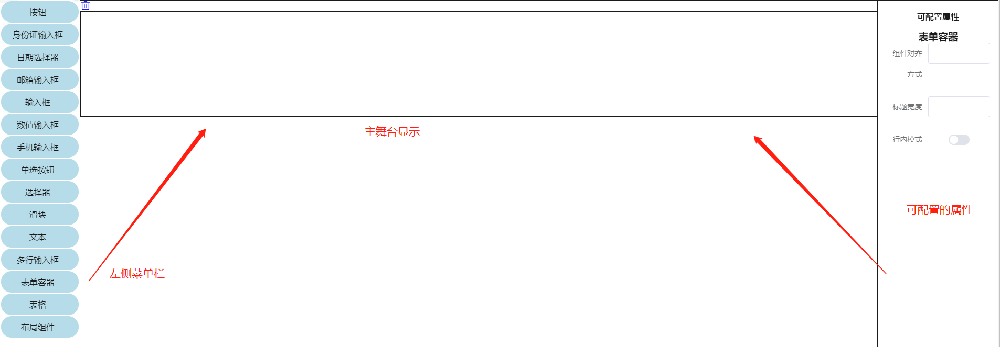

# form表单组件

### 1 当你在编辑器中拖入一个`form`组件,如下图:



### 2 点击导出页面,会自动生成`vue`代码并下载,内容如下:
```
<template>
	<div>

		<hb-form :comData="data1596507323571" v-bind='data1596507323571' >	</hb-form>

	</div>
</template>
<script>
export default {
	data() {
    	return {
	"data1596507323571": {}
}
	},
}
</script>
```

`data`数据中返回 `data1596507323571`对象,`data1596507323571`此对象代表`form`组件的数据,
可以在`data1596507323571`数据中添加下面的属性,也可以直接在配置面板中配置

### 注意!!! 一般`form`组件不单独使用,里面会嵌套其他组件一起使用

### Attributes

| 参数          |       说明       |    类型 | 可选值 | 默认值 |
| ------------- | :--------------: | ------: | -----: | -----: |
| labelposition |   组件对齐方式   |  string |     -- |   left |
| labelwidth    | 内部组件标题宽度 |  number |     -- |    100 |
| inline        | 内部组件行内模式 | boolean |     -- |  false |