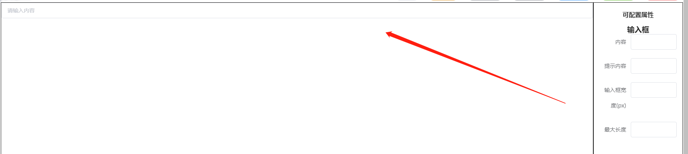
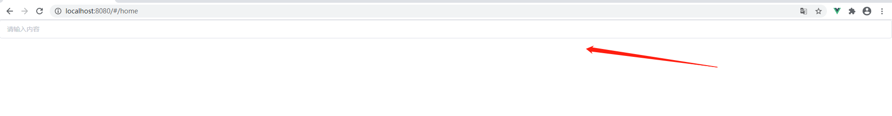
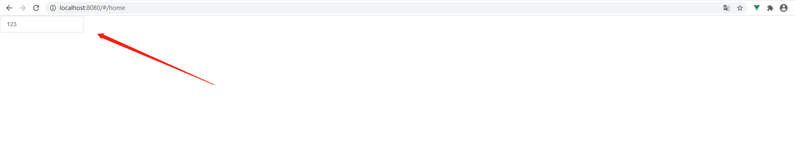

# 普通输入框

### 1 当你在编辑器中拖入一个`input`输入框组件,如下图:



### 2 点击导出页面,会自动生成`vue`代码并下载,内容如下:

```
<template>
  <div>
    <hb-input :comData="data1596091382469" v-bind="data1596091382469"></hb-input>
  </div>
</template>
<script>
export default {
  data() {
    return {
      data1596091382469: {}
    };
  },
};
```

`data`数据中返回 `data1596091382469`对象,`data1596091382469`此对象代表`input`组件的数据

### 3 将页面放入自己的项目中,然后运行查看效果如下:



### 4 改变数据或者样式,修改代码如下:

```
...
export default {
  data() {
    return {
      data1596091382469: {
          content:"123",
          width:"200"
      }
    };
  },
};
```
此时,页面已经改变:



更多属性请参考 `api`链接,自行尝试

### Attributes

| 参数        |          说明          |   类型 | 可选值 |       默认值 |
| ----------- | :--------------------: | -----: | -----: | -----------: |
| v-model     |         绑定值         |    any |     -- |           -- |
| content     |          内容          |    any |     -- |           -- |
| placeholder |     输入框占位文本     | string |     -- | 请输入身份证 |
| width       |     输入框宽度(px)     | string |     -- |         100% |
| maxLength   | 原生属性，最大输入长度 | string |     -- |           -- |

>基本上包含了 `elementUI` 属性 ,`api`参考地址: https://element.eleme.cn/#/zh-CN/component/input

