# 快速开始

# 开始使用
<span id='开始使用'></span>

本文针对设计器部分功能进行了描述，更多的功能请[进入设计器](http://fm.hei.fit/)进行体验

## 页面介绍

<span id='页面介绍'></span>

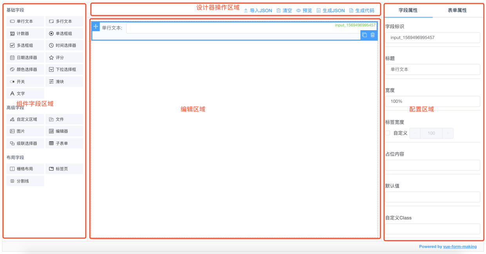

## 数据绑定

<span id='数据绑定'></span>

通过配置【字段标识】来绑定数据。

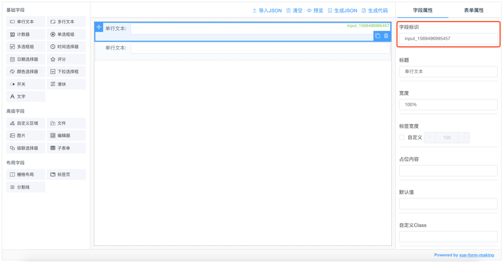

如果不想为字段绑定数据，可以在【操作属性】中取消【数据绑定】的选中

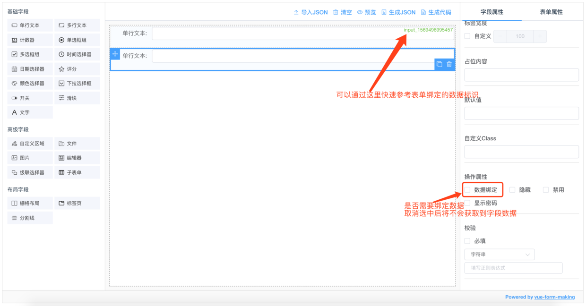

## 生成JSON

<span id='生成json'></span>

复制JSON数据直接用于生成表单页面。

组件调用方法参考： `getJSON`

## 导入JSON

<span id='导入json'></span>

可以将设计器中生成的JSON导入设计器中进行再次编辑。

组件调用方法参考： `setJSON`

## 生成代码

<span id='生成代码'></span>

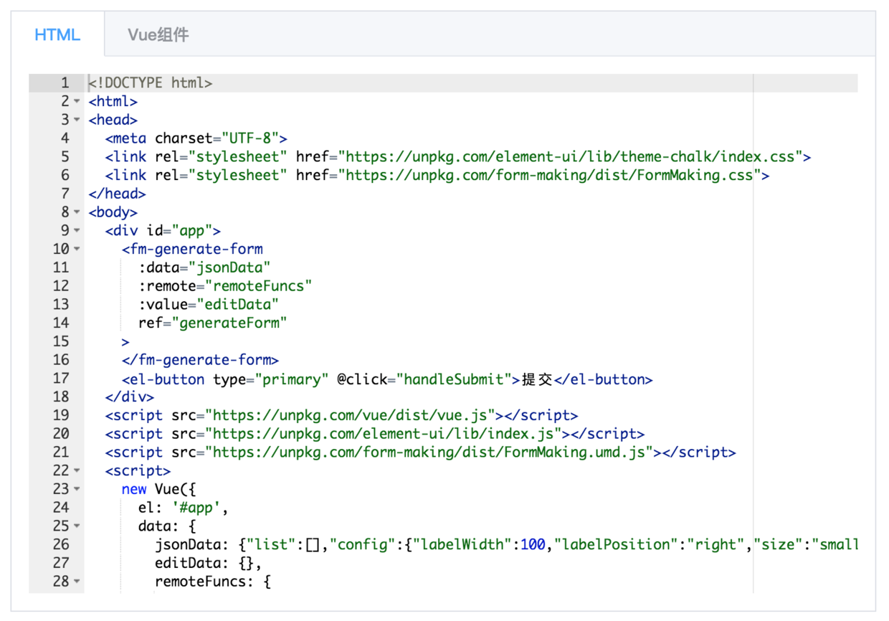

【生成代码】直接可以生成可以运行的 html 代码，直接复制到 `.html` 即可查看效果；如果需要在 Vue 组件中使用，请切换到【Vue组件】标签查看

组件调用方法参考： `getHtml`
# 表单布局

## 栅格布局

<span id='表单布局'></span>

通过基础的 1/24 分栏进行表单布局，可以嵌套使用，支持 Flex，基本可覆盖复杂的表单布局场景。

### 多列布局

<span id='多列布局'></span>

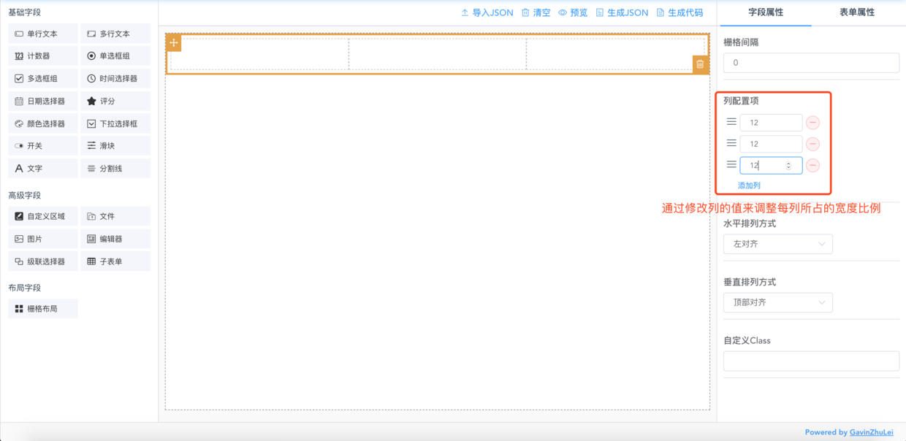

### 嵌套布局

<span id='嵌套布局'></span>

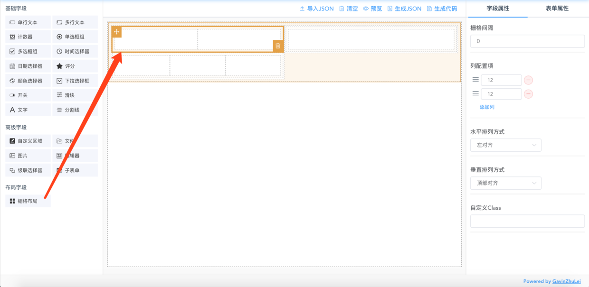

### 更多复杂布局

<span id='更多复杂布局'></span>

更多的复杂布局可以通过自定义样式调整，具体操作请参考：[自定义样式](http://docs.form.making.link/manual/custom-style.html)

# 自定义样式

> 自定义样式是采用样式覆盖的方式来实现，通过添加类名定义，用新的样式覆盖原有的样式。

## 表单样式自定义

*   表单属性【自定义Class】中填写自定义样式类名

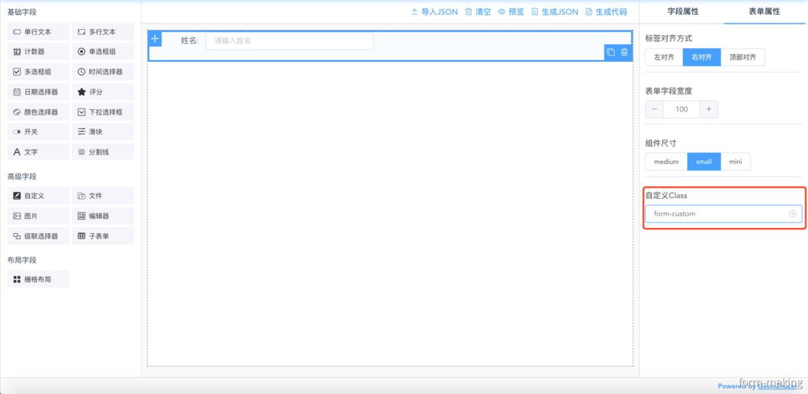

表单渲染时会在生成  `<form/>`  标签中加入 class

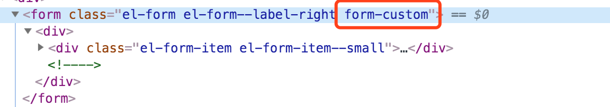

*   全局或者局部定义样式，实现表单样式的自定义

``` 
.form-custom{
  padding: 10px;
  background: #eee;
  border: 1px solid #ccc;
}

```

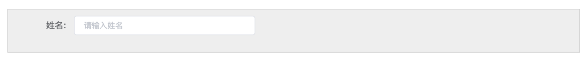

## 字段样式自定义

*   在【字段属性】配置中定义样式类名 【自定义Class】： `form-item-custom`

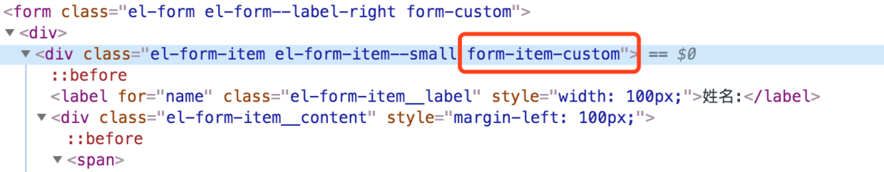

*   全局或者局部定义样式，实现字段样式的自定义

``` 
.form-item-custom .el-form-item__label{
  color: blue;
}
```


# 自定义区域

该扩展相当于是引入一个作用域插槽，可以为表单引入自己定义的内容，不了解的可以参考 [作用域插槽](https://cn.vuejs.org/v2/guide/components-slots.html#%E4%BD%9C%E7%94%A8%E5%9F%9F%E6%8F%92%E6%A7%BD)

> 设计器中显示区域，组件在生成器中直接引入

## 引入自定义组件

1.  拖拽【自定义区域】放入编辑区域

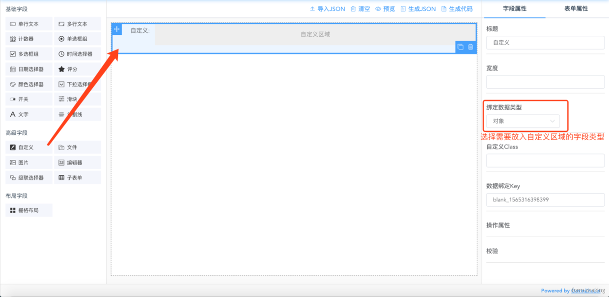

2.  根据你需要放入到该区域的字段选择类型

3.  点击【生成代码】可快速查看，通过编码方式放入自己的组件

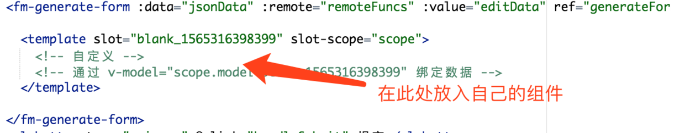

``` 
<!-- 添加如下代码 -->
<fm-generate-form>
  <template slot="blank_1565316398399" slot-scope="scope">
    <!-- 自定义 -->
    <!-- 通过 v-model="scope.model.blank_1565316398399" 绑定数据 -->
    宽度：<el-input v-model="scope.model.blank_1565316398399.width" style="width: 100px"></el-input>
    高度：<el-input v-model="scope.model.blank_1565316398399.height" style="width: 100px"></el-input>
  </template>
</fm-generate-form>

```

4.  完成引入，预览一下查看效果

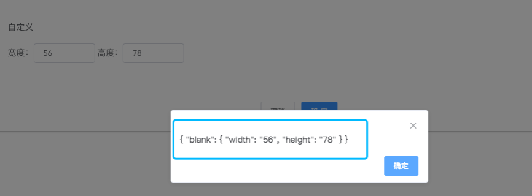

## 引入静态内容

静态内容即不用绑定数据的内容，在【操作属性】中去掉【数据绑定】选择。


1.  拖拽自定义区域字段到编辑区，去掉【数据绑定】勾选。

2.  点击【生成代码】复制修改代码

``` 
<fm-generate-form 
  :data="jsonData" 
  :remote="remoteFuncs" 
  :value="editData" 
  ref="generateForm"
>
    <template slot="blank" slot-scope="scope">
      <!-- 自定义区域 -->
      这是一段静态文本
    </template>
</fm-generate-form>

```

3.  预览查看效果

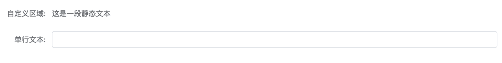

4.  获取数据将不会获取到自定义静态区域的数据

``` 
{
  "input_1566990348038": ""
}
```


# 自定义组件

在设计器中可以自己配置自定义的组件。

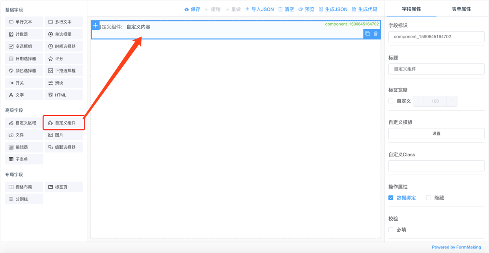

## 静态内容

即不绑定表单数据，可以自定义一些表单中的静态元素。

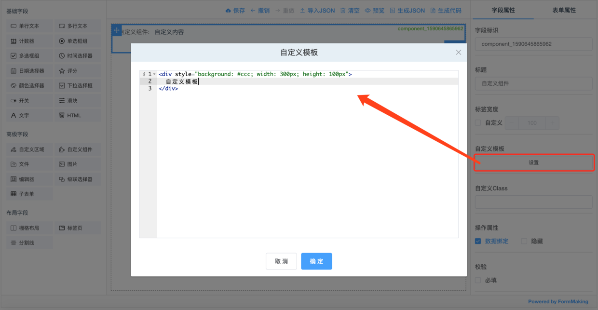

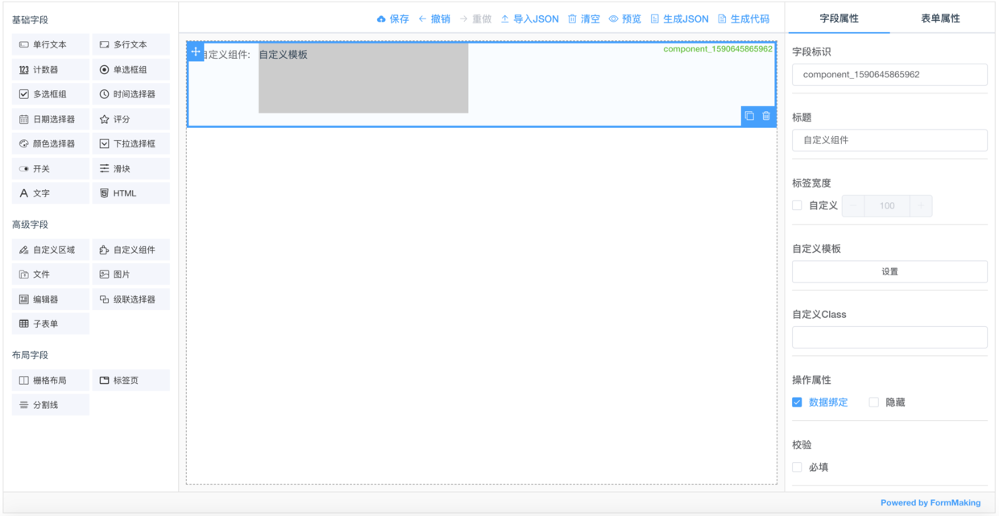

## 绑定数据

如果需要输入内容并且获取，则需要在模板中使用 `v-model="dataModel"` 进行数据绑定。（必须保证组件可以使用v-model进行数据双向绑定）

```
<div style="background: #ccc; width: 300px; height: 100px">
  <!-- v-model="dataModel" 是必须的，这样才能绑定数据 -->
  <input v-model="dataModel" style="margin: 20px;">
</div>
```

# 远端数据

单选框，多选框，下拉选择框等选择项需要通过数据生成，这时可以配置远端数据

1.  设置远端数据获取方法名，选项值（用于选择项真实获取的值），选项标签（用于选项展示的值）

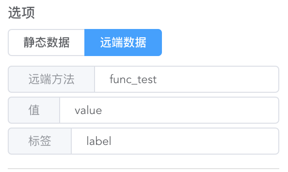

2.  调用 `fm-generate-form` 渲染组件，使用设计器中设置好的方法获取数据

```
<fm-generate-form 
  :data="jsonData" 
  :remote="remoteFuncs" 
  :value="editData" 
  ref="generateForm">
</fm-generate-form>

```

```
remoteFuncs: {
  func_test (resolve) {
    // 下拉选择框 select_1566990949275
    // 获取到远端数据后执行回调函数
    // resolve(data)
    // 模拟数据获取
    setTimeout(() => {
      const options = [
        {value: 'value1', label: 'label1'},
        {value: 'value1', label: 'label1'},
        {value: 'value1', label: 'label1'},
      ]
      // 对象中 value、label 是设计器中配置的值和标签
      resolve(options)
    }, 2000)
  },
}

```

> 可以通过【生成代码】快速获取需要绑定远端数据的方法，结构如上图，获取数据后必须调用 resolve 回调方法将值赋给组件

3.  查看效果

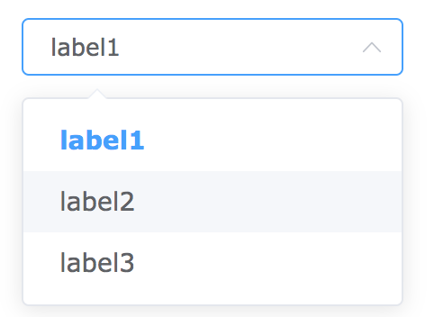


# 文件或图片上传

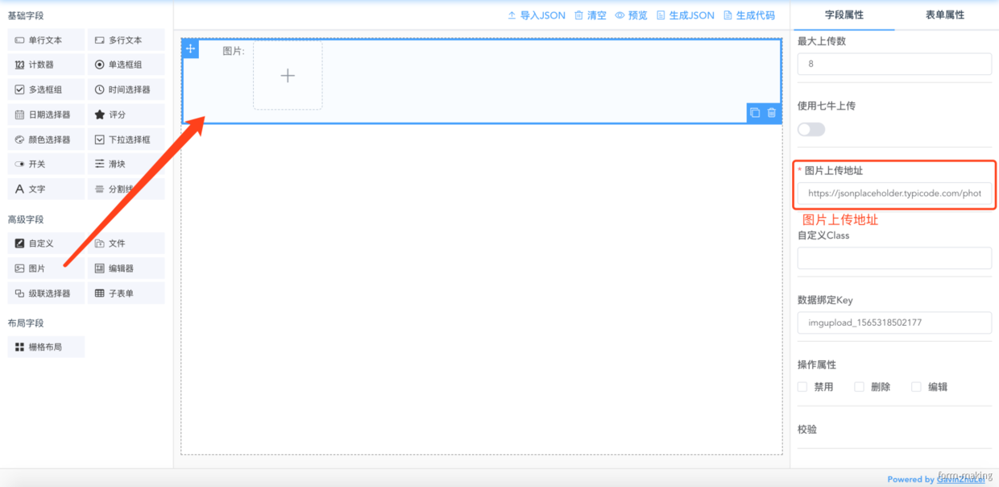

## 服务器上传

配置服务器上传地址，这里需要服务器返回数据格式如下：

```
{
  "url": "图片访问地址"
}

```

## 七牛云上传

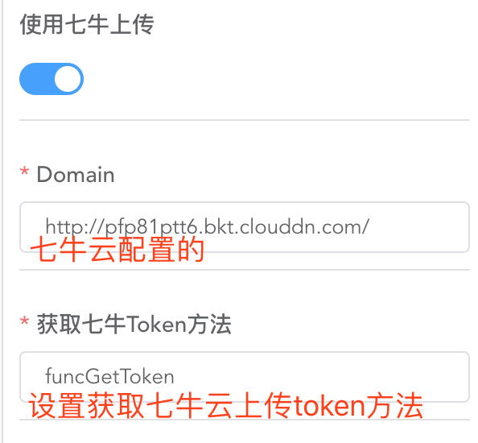

如果使用的是七牛云上传图片，如上图配置好参数，点击【生成代码】来快速查看编辑位置

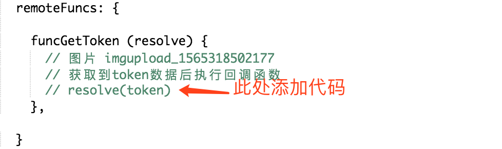

```
funcGetToken (resolve) {
  request.get('http://tools-server.making.link/api/uptoken').then(res => {
    resolve(res.uptoken)
  })
}

```

获取token的方法需要后端提供，详细请参考七牛云文档


# 子表单

## 操作步骤

1.  拖拽【子表单】字段放入编辑区域

2.  然后将需要配置的列拖入到子表单中

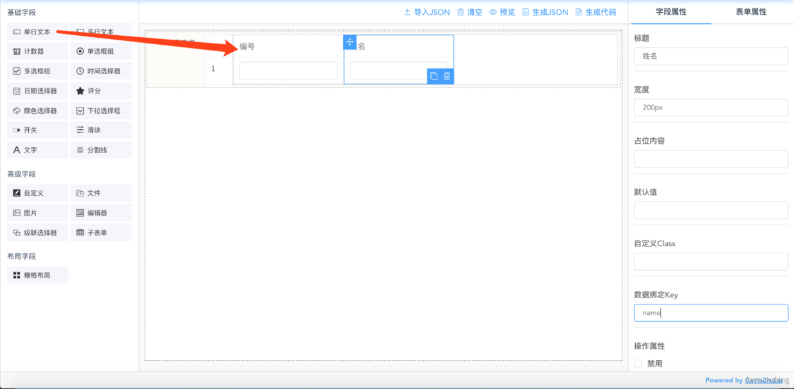

3.  【预览】，点击【添加】，填入数据


4.  获取数据

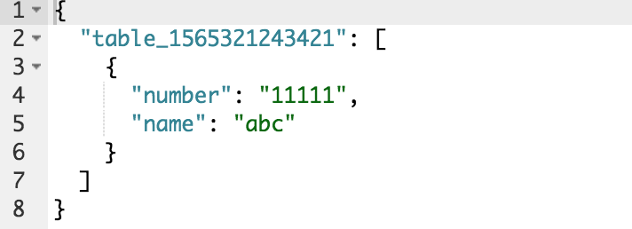


# 表单示例

这里将展示一些可以用设计器实现出来的一些表单格式

## 基础使用

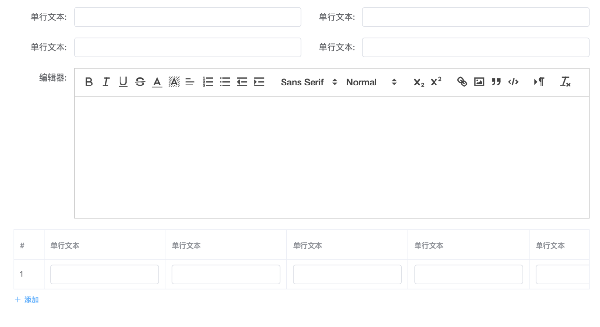

## 表格样式

可以通过栅格布局和自定义样式来配合使用完成表格边框的创建，设计器中内置了`border-form`样式快速实现效果。

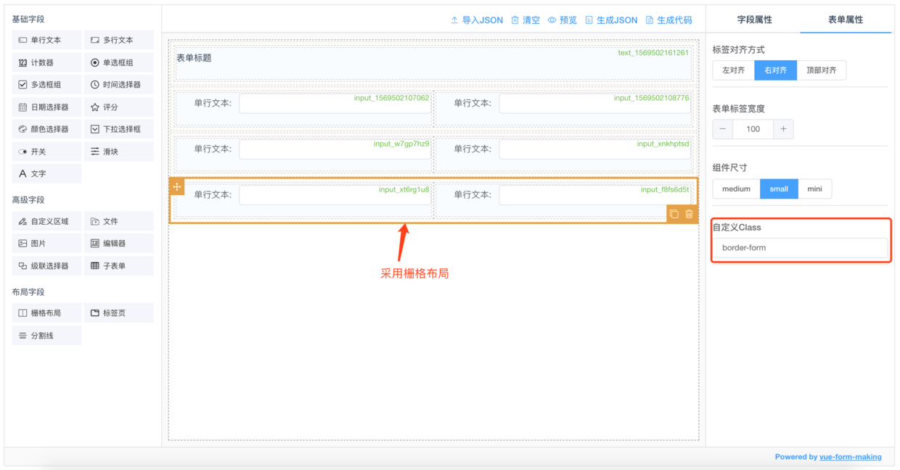

预览查看效果：

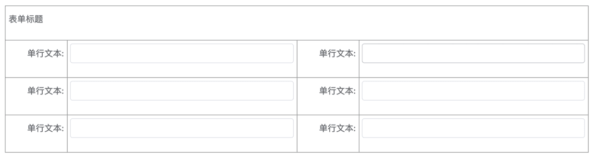


# 自定义设计器字段

> 高级版本@1.2.13 新增功能

可以在设计器左侧配置自己的组件进行操作。

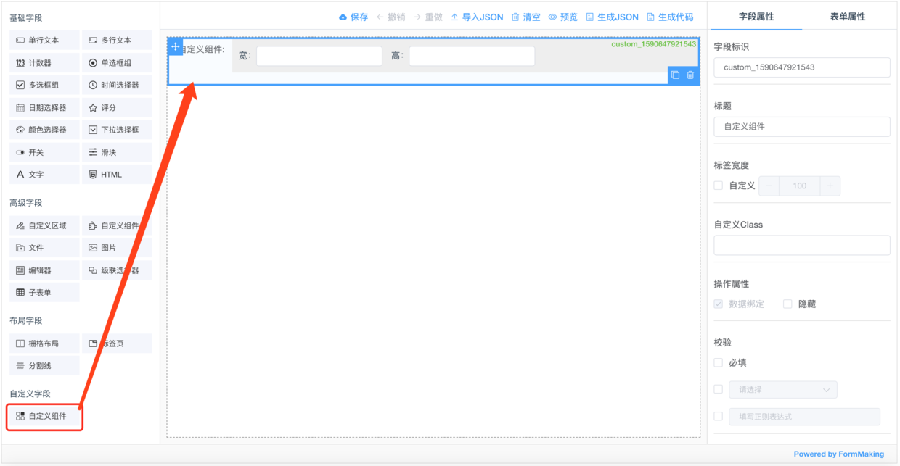

## 自定义字段自定义组件

我们简单实现个自定义组件如下：

```
<template>
  <div class="custom-component">
    <span>
      宽：<el-input v-model="dataModel.width" style="width: 200px;"></el-input>
    </span>
    <span>
      高：<el-input v-model="dataModel.height" style="width: 200px;"></el-input>
    </span>
  </div>
</template>

<script>
export default {
  name: 'custom-width-height',
  props: {
    value: {
      type: Object,
      default: () => ({})
    }
  },
  data() {
    return {
      dataModel: this.value
    }
  },
  watch: {
    value (val) {
      this.dataModel = val
    },
    dataModel (val) {
      this.$emit('input', val)
    }
  }
}
</script>

<style lang="scss">
.custom-component{
  background: #eee;
  padding: 10px;

  span{
    +span{
      margin-left: 10px;
    }
  }
}
</style>

```

> 需要注意，自定义组件必须能够使用 `v-model` 进行双向绑定，如果还不知道如何创建，可以自行先阅读 Vue.js 文档。

## 注册组件

```
Vue.use(FormMaking, {
  components: [{
    name: 'custom-width-height',
    component: CustomComponent // 自定义组件
  }]
})

```

也可以使用 `Vue.component` 进行组件的注册

## 设计器配置

```
<template>
  <fm-making-form
    :custom-fields="customFields"
  >
  </fm-making-form>
</template>

<script>
export default {
  data() {
    return {
      customFields: [
        {
          name: '自定义组件', // 字段名称
          el: 'custom-width-height', // 组件注册的名称
          options: {
            /* 下面是设计器中自带的字段属性，可以根据自己组件的属性来进行配置 */
            defaultValue: {}, // 默认值
            customClass: '', // 自定义样式
            labelWidth: 100, // 标签宽度
            isLabelWidth: false, // 是否展示标签
            hidden: false, // 隐藏属性
            dataBind: true, // 数据绑定属性
            width: 100,
            height: 100,
            placeholder: '',
            readonly: false, // 只读
            disabled: false, // 禁用
            editable: false, // 可编辑
            clearable: false, // 可清除
            required: false, // 必填校验
            dataType: '', // 数据类型校验
            pattern: '', // 正则表达式校验
          }
        }
      ]
    }
  }
}
</script>
```
